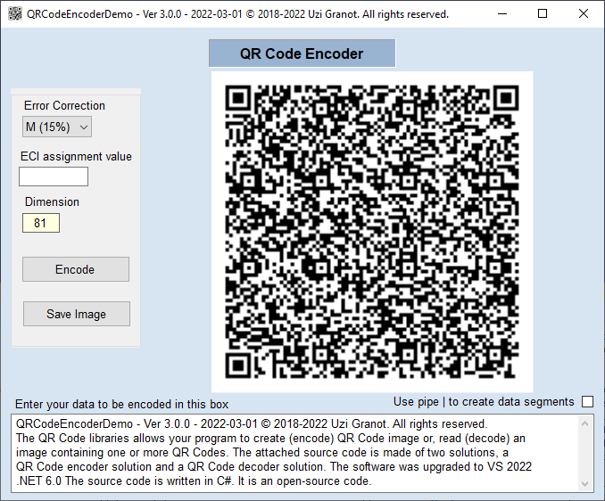

# QR Encoding and Decoding Library
QR Code libraries to allow program to create QR Code image or read image containing one or more QR Codes

Based on code from:
[QR Code Encoder and Decoder C# Class Library](https://www.codeproject.com/Articles/1250071/QR-Code-Encoder-and-Decoder-Csharp-Class-Library-f)

## Prerequisites
* Visual Studio 2022
* .NET 6
* Windows

## Getting started
* open `QRCodeLibrary.sln`

## Changes from original project
* used [Serilog](https://serilog.net/) for logging
* ported to .NET Core 6
* refactored
* added encoder + decoder unit tests

## Notes
* even though the code compiles on _Linux_, it only runs on _Windows_
  as it uses APIs which are not implemented on non-_Windows_ platforms

## Further work
* use [ImageSharp](https://github.com/SixLabors/ImageSharp) for graphics operations
* support _Linux_

